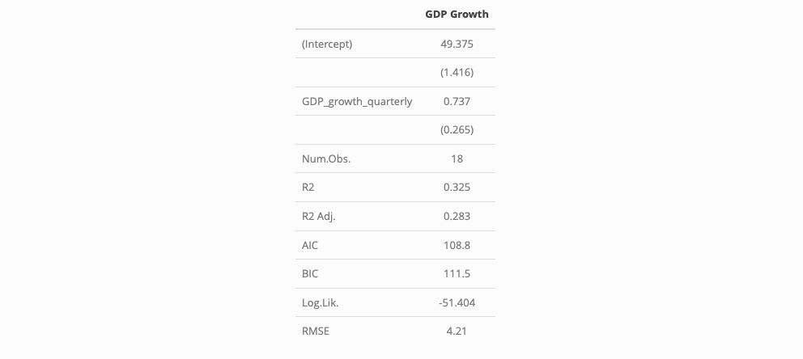
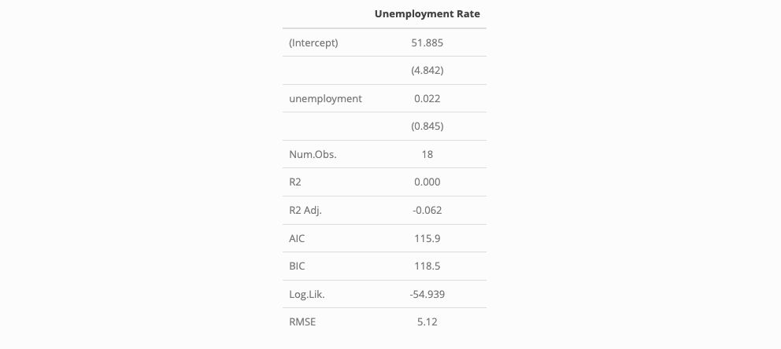
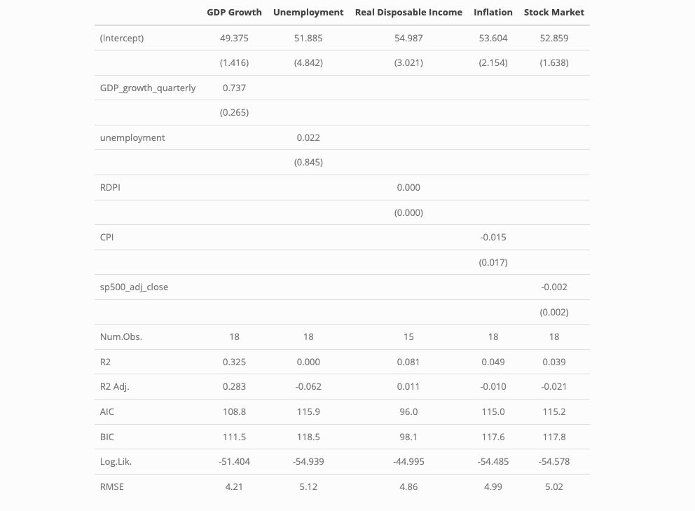

In this week's lab, we focus on understanding how well the status of the economy predicts the outcome of an election. In particular, we aim to quantify this uncertainty. My thanks again to Matt Dardet for his generous starter code in section, much of which I have used/adapted here. 

```{r echo = FALSE}
# Load libraries and datasets

library(car)
library(tidyverse)
library(modelsummary)
show_col_types = FALSE
config_modelsummary(startup_message = FALSE)

d_popvote <- read_csv("popvote_1948-2020.csv")
d_fred <- read_csv("fred_econ.csv")
d_bea <- read_csv("bea_econ.csv") |> 
  rename(year = "Year",
         quarter = "Quarter", 
         gdp = "Gross domestic product", 
         gnp = "Gross national product", 
         dpi = "Disposable personal income", 
         consumption = "Personal consumption expenditures", 
         goods = "Goods", 
         durables = "Durable goods", 
         nondurables = "Nondurable goods", 
         services = "Services", 
         pop = "Population (midperiod, thousands)")

# Merged econ data
d_inc_econ <- d_popvote |> 
  filter(incumbent_party == TRUE) |> 
  select(year, pv, pv2p, winner) |> 
  left_join(d_fred |> filter(quarter == 2)) |> 
  left_join(d_bea |> filter(quarter == "Q2") |> select(year, dpi))

# Merged econ data, but without the year 2020
d_inc_econ_2 <- d_inc_econ |>
  filter(year != 2020)
```

First, we explored how well the economy *correlated* with election outcomes by computing the bivariate correlation between quarterly GDP growth and incumbent two-party vote share. We began by reviewing a scatterplot of this data.

```{r echo = FALSE}
# Scatterplot with labels
d_inc_econ |>
  ggplot(aes(x=GDP_growth_quarterly, y=pv2p)) +
  geom_point()+
  geom_label(aes(label = year)) +
  labs(title = "Two-Party Popular Vote Share by GDP Growth",
       x = "Quarterly GDP Growth",
       y = "Two-Party Popular Vote Share")
```

Clearly, this scatterplot shows that 2020 is a significant outlier, due to the significant decline in GDP right before the election. Therefore, when we compute the correlation between GDP growth and two-party vote share for the incumbent party in the election, it makes sense to also calculate the correlation excluding this year.

```{r echo = FALSE}
# Correlation of GDP and two-party vote share (with 2020)
gdp_cor_2020 <- cor(d_inc_econ$GDP_growth_quarterly, 
    d_inc_econ$pv2p)

# Correlation of GDP and two-party vote share (without 2020)

gdp_cor_no_2020 <- cor(d_inc_econ_2$GDP_growth_quarterly, 
    d_inc_econ_2$pv2p)

gdp_cor_2020 
gdp_cor_no_2020
```

We find that while there is a slight positive correlation (r = 0.43) between GDP growth and incumbent party vote share even including 2020, the correlation becomes even stronger when dropping 2020 (r = 0.57). 

Seeing what appears to be a relationship between these variables, we then move into *fitting a model* to this data. Since the scatterplot appeared to demonstrate a linear relationship, especially when removing the outlier of 2020, we fitted a linear regression model to our dataset without 2020. 

```{r echo = FALSE}
# OLS regression using data without 2020.

reg_econ_no_2020 <- lm(data = d_inc_econ_2, pv2p~GDP_growth_quarterly)
msummary(list("GDP Growth" = reg_econ_no_2020), output = "gdp_output_table.jpg")
```



This model suggests that a one percentage point increase in quarterly GDP growth predicts a ~0.7 percentage point increase national two-party popular vote share for the incumbent party during the upcoming election. Interestingly, the model also has an intercept of 49.4, implying that if there is no economic growth in the quarter before an election, the incumbent party is predicted to not gain a plurality of the votes. This suggests that voters particularly value economic growth, not just economic stability or the prevention of an economic decline.

However, we also want to *evaluate this model* and its success in prediction. To do so, we conducted several tests of in-sample and out-of-sample predictive power. I highlight one of each here.

*In-Sample Fit: R^2 Value*

```{r echo = FALSE}
# R-Squared values
summary(reg_econ_no_2020)$r.squared
```

We find an R^2 value of 0.32. This is a fairly modest figure, suggesting that we may need to make further modifications to this model to improve its fit

*Out-of-Sample Prediction: Cross Validation*

```{r echo = FALSE}
# Create a loop that produces 1000 estimates of out of sample error, using a random subset that is taken out
out_samp_errors <-sapply(1:1000, function(i) {
  years_out_samp <- sample(d_inc_econ_2$year, 9) # Pick a random sample of years to extract from our dataset, and try to predict their outcomes later based on the other data
  mod_without_subset <- lm(pv2p~GDP_growth_quarterly, data = d_inc_econ_2[!(d_inc_econ_2$year %in% years_out_samp),])# Fit model without subset
  out_samp_pred <- predict(mod_without_subset, d_inc_econ_2[d_inc_econ_2$year %in% years_out_samp,]) # Predict values for years taken out based on model fit without them
  out_samp_truth <- d_inc_econ_2$pv2p[d_inc_econ_2$year %in% years_out_samp] # Real values for years taken out
  mean(out_samp_pred - out_samp_truth) # Average of the difference between truth
})

# Visualize distribution
hist(out_samp_errors)

```

This histogram demonstrates the results when we removed sets of nine random elections, fit a linear model to the remaining data, and evaluated the accuracy of that fitted model to the randomly removed data. In general, our model appears to make fairly accurate predictions. In other words, while our model may have appeared weak previously, this visualization demonstrates that it is stronger than we thought.

*Out-of-sample extrapolation: 2024*

```{r echo = FALSE}
# Pull most recent economic data from FRED dataset
GDP_new <- d_fred |>
  filter(year == 2024 & quarter == 2) |>
  select(GDP_growth_quarterly)

# Predict the expected incumbent two party vote share based on inputs from FRED and model fitted from prior data
predict(reg_econ_no_2020, GDP_new, interval = "prediction")
```

We can also use this model to predict the upcoming 2024 election, using recent economic data. This prediction suggests that the incumbent Democratic party can expect to receive about 51.58% of the two-party vote share in the 2024 election. However, the margin of error on this prediction ranges from 41.86% to 61.31%, implying that the election could still swing either way.

Given that we've observed the limitations of a simple bivariate linear model, we also observed several methods to *improve this model*

Of course, GDP growth is only one metric of economic performance. Therefore, I also tested how well the unemployment rate predicted election outcomes. I again excluded 2020 because our previous graph showed it as an economic outlier. 

```{r echo = FALSE}
# Regression of incumbent two party vote share vs unemployment rate
reg_unemp <- lm(pv2p~unemployment, data = d_inc_econ_2)

# Outputting image of regression characteristics
msummary(list("Unemployment Rate" = reg_unemp), output = "unemp_output_table.jpg")
```


Unfortunately, the r^2 value of this regression is much smaller than that using GDP growth as a predictor, meaning that it is a less useful model.

As an *extension*, I conducted the same analysis for several other economic variables, summarizing it in the table below.

```{r echo = FALSE}
library(modelsummary)

reg_rdi <- lm(pv2p~RDPI, data = d_inc_econ_2) # Regression on Real Disposable Income

reg_inf <- lm(pv2p~CPI, data = d_inc_econ_2) # Regression on Inflation

reg_stocks <- lm(pv2p~sp500_adj_close, data = d_inc_econ_2) # Regression on Stock market performance

regressions <- list(
  "GDP Growth" = reg_econ_no_2020,
  "Unemployment" = reg_unemp,
  "Real Disposable Income" = reg_rdi,
  "Inflation" = reg_inf,
  "Stock Market" = reg_stocks
  ) # Referenced: https://tilburgsciencehub.com/topics/visualization/data-visualization/regression-results/model-summary/

# Produce output of all regressions
msummary(regressions, output = "all_output_table.jpg")
```


These results suggest that GDP remains the best economic predictor of voting outcomes among those available to us, with a higher R^2 value than all of the others. However, the R^2 value is still relatively low, meaning that we still need to consider many other factors in order to produce more accurate models. 

# Citations:

Generate regression tables in R with the `modelsummary` package—Tilburg Science Hub. (n.d.). Tillburg ScienceHub. Retrieved September 14, 2024, from https://tilburgsciencehub.com/topics/visualization/data-visualization/regression-results/model-summary/

Hlavac, Marek (2022). stargazer: Well-Formatted Regression and Summary Statistics Tables.R package version 5.2.3. https://CRAN.R-project.org/package=stargazer 

R code chunk appears in post summary · Issue #426 · rstudio/blogdown. (n.d.). GitHub. Retrieved September 14, 2024, from https://github.com/rstudio/blogdown/issues/426

