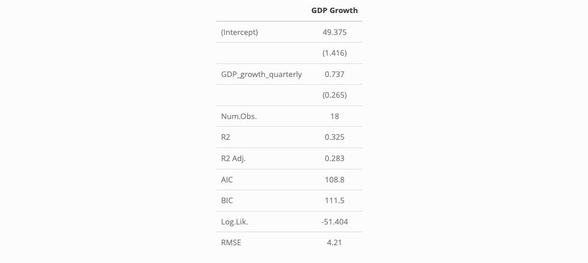
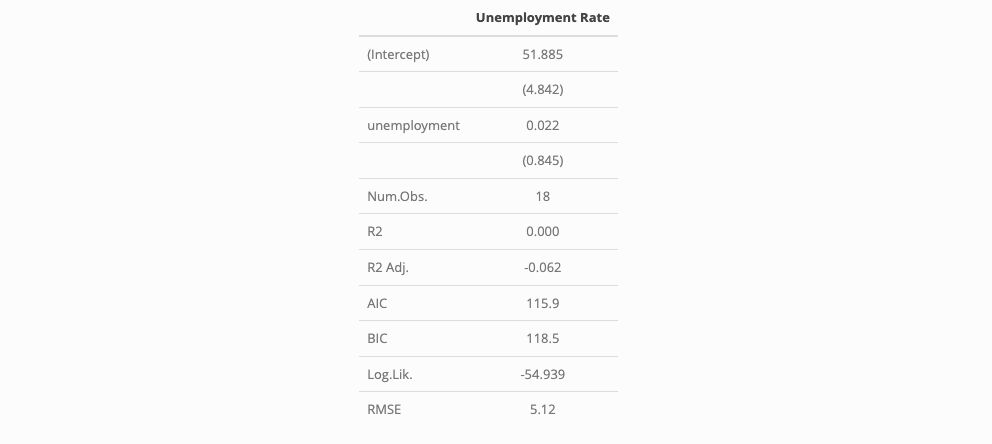
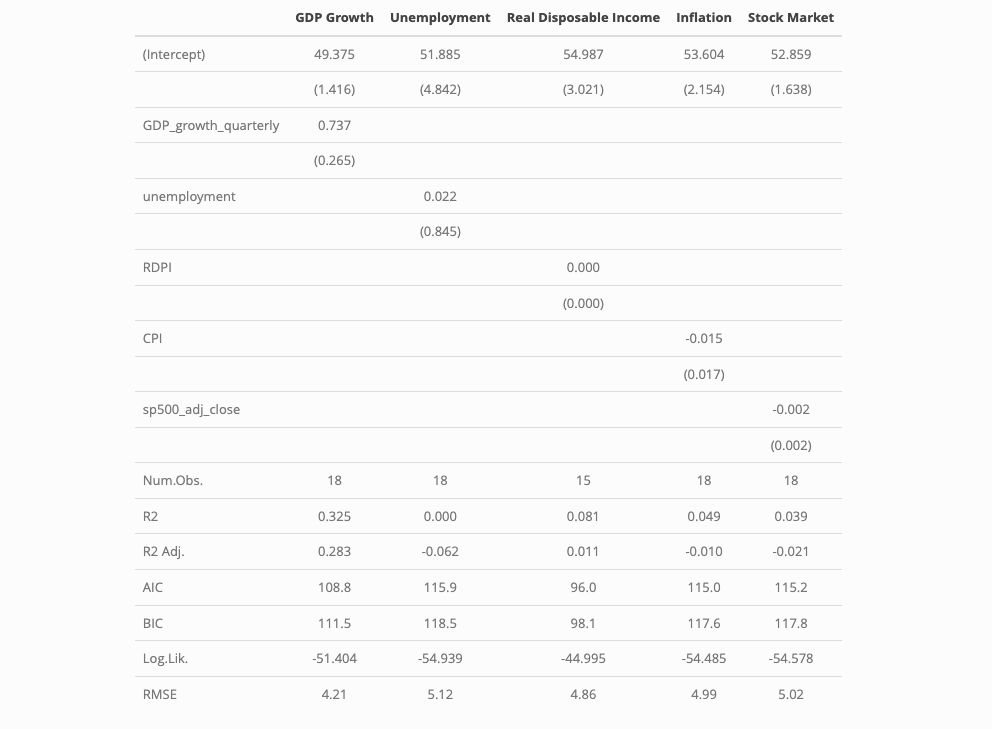

In this week's lab, we focus on understanding how well the status of the economy predicts the outcome of an election. In particular, we aim to quantify this uncertainty. My thanks again to Matt Dardet for his generous starter code in section, much of which I have used/adapted here. 


```
## Loading required package: carData
```

```
## ── Attaching core tidyverse packages ──────────────────────── tidyverse 2.0.0 ──
## ✔ dplyr     1.1.4     ✔ readr     2.1.5
## ✔ forcats   1.0.0     ✔ stringr   1.5.1
## ✔ ggplot2   3.5.1     ✔ tibble    3.2.1
## ✔ lubridate 1.9.3     ✔ tidyr     1.3.1
## ✔ purrr     1.0.2     
## ── Conflicts ────────────────────────────────────────── tidyverse_conflicts() ──
## ✖ dplyr::filter() masks stats::filter()
## ✖ dplyr::lag()    masks stats::lag()
## ✖ dplyr::recode() masks car::recode()
## ✖ purrr::some()   masks car::some()
## ℹ Use the conflicted package (<http://conflicted.r-lib.org/>) to force all conflicts to become errors
## `modelsummary` 2.0.0 now uses `tinytable` as its default table-drawing
##   backend. Learn more at: https://vincentarelbundock.github.io/tinytable/
## 
## Revert to `kableExtra` for one session:
## 
##   options(modelsummary_factory_default = 'kableExtra')
##   options(modelsummary_factory_latex = 'kableExtra')
##   options(modelsummary_factory_html = 'kableExtra')
## 
## Silence this message forever:
## 
##   config_modelsummary(startup_message = FALSE)
## 
## Rows: 38 Columns: 9
## ── Column specification ────────────────────────────────────────────────────────
## Delimiter: ","
## chr (2): party, candidate
## dbl (3): year, pv, pv2p
## lgl (4): winner, incumbent, incumbent_party, prev_admin
## 
## ℹ Use `spec()` to retrieve the full column specification for this data.
## ℹ Specify the column types or set `show_col_types = FALSE` to quiet this message.
## Rows: 387 Columns: 14
## ── Column specification ────────────────────────────────────────────────────────
## Delimiter: ","
## dbl (14): year, quarter, GDP, GDP_growth_quarterly, RDPI, RDPI_growth_quarte...
## 
## ℹ Use `spec()` to retrieve the full column specification for this data.
## ℹ Specify the column types or set `show_col_types = FALSE` to quiet this message.
## Rows: 310 Columns: 11
## ── Column specification ────────────────────────────────────────────────────────
## Delimiter: ","
## chr  (1): Quarter
## dbl (10): Year, Gross domestic product, Gross national product, Disposable p...
## 
## ℹ Use `spec()` to retrieve the full column specification for this data.
## ℹ Specify the column types or set `show_col_types = FALSE` to quiet this message.
## Joining with `by = join_by(year)`
## Joining with `by = join_by(year)`
```

First, we explored how well the economy *correlated* with election outcomes by computing the bivariate correlation between quarterly GDP growth and incumbent two-party vote share. We began by reviewing a scatterplot of this data.

}}index_files/figure-html/unnamed-chunk-2-1.png" width="672" />

Clearly, this scatterplot shows that 2020 is a significant outlier, due to the significant decline in GDP right before the election. Therefore, when we compute the correlation between GDP growth and two-party vote share for the incumbent party in the election, it makes sense to also calculate the correlation excluding this year.


```
## [1] 0.4336956
```

```
## [1] 0.569918
```

We find that while there is a slight positive correlation (r = 0.43) between GDP growth and incumbent party vote share even including 2020, the correlation becomes even stronger when dropping 2020 (r = 0.57). 

Seeing what appears to be a relationship between these variables, we then move into *fitting a model* to this data. Since the scatterplot appeared to demonstrate a linear relationship, especially when removing the outlier of 2020, we fitted a linear regression model to our data. 


```
## save_kable will have the best result with magick installed.
```



This model suggests that a one percentage point increase in quarterly GDP growth predicts a ~0.7 percentage point increase national two-party popular vote share for the incumbent party during the upcoming election. Interestingly, the model also has an intercept of 49.4, implying that if there is no economic growth in the quarter before an election, the incumbent party is predicted to not gain a plurality of the votes. This suggests that voters particularly value economic growth, not just economic stability or the prevention of an economic decline.

However, we also want to *evaluate this model* and its success in prediction. To do so, we conducted several tests of in-sample and out-of-sample predictive power. I highlight one of each here.

*In-Sample Fit: R^2 Value*


```
## [1] 0.3248066
```

We find an R^2 value of 0.32. This is a fairly modest figure, suggesting that we may need to make further modifications to this model to improve its fit

*Out-of-Sample Prediction: Cross Validation*

}}index_files/figure-html/unnamed-chunk-6-1.png" width="672" />

This distribution shows that, in general, our model appears to make fairly accurate predictions. In other words, while our model may have appeared weak previously, this visualization demonstrates that it is stronger than we thought.

*Out-of-sample extrapolation: 2024*


```
##        fit      lwr     upr
## 1 51.58486 41.85982 61.3099
```

We can also use this model to predict the upcoming 2024 election, using recent economic data. This prediction suggests that the incumbent Democratic party can expect to receive about 51.58% of the two-party vote share. However, the margin of error on this prediction ranges from 41.86% to 61.31%, implying that the election could still swing either way.

Given that we've observed the limitations of a simple bivariate linear model, we also observed several methods to *improve this model*

Of course, GDP growth is only one metric of economic performance. Therefore, I also tested how well the unemployment rate predicted election outcomes. I again excluded 2020 because our previous graph showed it as an economic outlier. 


```
## save_kable will have the best result with magick installed.
```




Unfortunately, the r^2 value of this regression is much smaller than that using GDP growth as a predictor, meaning that it is a less useful model.

As an *extension*, I conducted the same analysis for several other economic variables, summarizing it in the table below.


```
## save_kable will have the best result with magick installed.
```


These results suggest that GDP remains the best economic predictor of voting outcomes among those available to us, with a higher R^2 value than all of the others. However, the R^2 value is still relatively low, meaning that we still need to consider many other factors in order to produce more accurate models. 

# Citations:

Generate regression tables in R with the `modelsummary` package—Tilburg Science Hub. (n.d.). Tillburg ScienceHub. Retrieved September 14, 2024, from https://tilburgsciencehub.com/topics/visualization/data-visualization/regression-results/model-summary/

Hlavac, Marek (2022). stargazer: Well-Formatted Regression and Summary Statistics Tables.R package version 5.2.3. https://CRAN.R-project.org/package=stargazer 

R code chunk appears in post summary · Issue #426 · rstudio/blogdown. (n.d.). GitHub. Retrieved September 14, 2024, from https://github.com/rstudio/blogdown/issues/426

