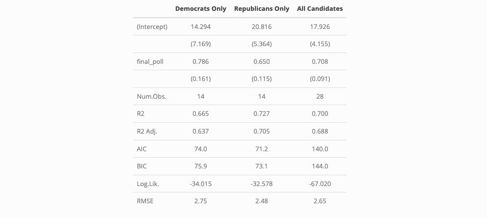

In this week's post, we focus on analyzing polling data. Our research question is "How can we best use polls to predict election outcomes?". My thanks again to Matthew Dardet for his generous starter code.

For the purpose of this analysis, we focus on polling data from FiveThirtyEight. We began by visualizing the available data from the past several presidential elections to help understand how polls changes relative to the actual election outcome.

}}index_files/figure-html/unnamed-chunk-2-1.png" width="672" />

These data show two-party polling averages at various stages of the election cycle, benchmarked against the actual vote share earned by each candidate during that year's election (horizontal lines). These averages are very likely affected by events occurring during the election cycle and each campaign's response to them. For example, we see a substantial decline in support for Donald Trump around June 2020 - perhaps corresponding to the murder of George Floyd (1).

However, it is interesting to see if election forecasts made using polling data in the few weeks prior to the election tend to be more predictive of the final outcomes than those considering prior weeks. Some, such Tien and Lewis-Beck, claim that "short-view forecasts," which solely rely on polling data, especially in the weeks prior to the election, tend to be inaccurate (2). While some of the charts above suggest relatively accurate November predictions (eg: Biden's polling in 2020), many others are very inaccurate. For example, polling about 15 weeks before the election better predicted Trump's 2016 vote share than polling in the weeks immediately prior. 

To test the accuracy of November polls, we computed several regressions of November polling averages on actual election outcomes between 1968 and 2020 (we have data as early as 1948, but we drop earlier years given that we do not have polling data from FiveThirtyEight from 1948-1964). I calculated three separate regressions, highlighted in the table below, which model predictions for only Democratic candidates, only Republicans, and both parties respectively.

Given that the Republican only model has an R^2 value of 0.727 while the Democrat only model has an R^2 value of 0.665 (with the combined model being in between), it appears that November polling data from FiveThirtyEight has, on average, been more predictive of Republican outcomes. However, I also wanted to see if the relationship may have been skewed by polling data from earlier years, which could be less accurate. To explore this, I wanted to see if polls from earlier years tended to be more inaccurate than more recent ones, starting with a scatterplot. 

}}index_files/figure-html/unnamed-chunk-4-1.png" width="672" />

This scatterplot, which includes a line demonstrating perfect poll prediction, shows that most November polls are somewhat inaccurate, often *underpredicting* candidate performance. However, given that it didn't clearly demonstrate trends in performance over the years, I calculated the ten years/candidates with the lowest November prediction error, including them in the table below.

| Year | Party | Two-Party Vote Share | Final Poll Prediction of Vote Share | Prediction Error |
|:----:|:-----:|:--------------------:|:-----------------------------------:|:----------------:|
| 2012 |  REP  |       48.0847        |               48.0837               |     -0.0011      |
| 2004 |  DEM  |       48.7307        |               48.7377               |      0.0070      |
| 2008 |  REP  |       46.2292        |               46.2130               |     -0.0163      |
| 2012 |  REP  |       48.0847        |               48.0672               |     -0.0175      |
| 2008 |  REP  |       46.2292        |               46.2483               |      0.0190      |
| 2020 |  DEM  |       52.2699        |               52.2495               |     -0.0204      |
| 2012 |  REP  |       48.0847        |               48.0519               |     -0.0329      |
| 2012 |  REP  |       48.0847        |               48.1219               |      0.0371      |
| 1988 |  DEM  |       46.1675        |               46.1279               |     -0.0397      |
| 2012 |  REP  |       48.0847        |               48.0439               |     -0.0409      |

This shows two interesting conclusions. First, all of the closest predictions have underpredicted candidate performance, showing a similar conclusion to the scatterplot. But second, and more relevantly, this tentatively suggests that recent polls haven't necessarily been more successful. Of course, we cannot make a causal argument from just these data and many recent years make up our top 10, but polling from 1968, the earliest year in our dataset, makes our top 10. This may lend credence to the argument that there are certain "fundamentals" that can help predict voter performance, regardless of data accuracy and statistical/computing power that pollsters may have access to (2). 

Keeping the relative inaccuracy of only using November polling to predict outcomes in mind, we also wanted to explore if considering polls at other times in an election cycle can result in better prediction outcomes. To do so, we used the regularization method of Elastic Net, identifying the most predictive combination of weeks based on historical polling and election outcome data.

I trained this model using data from before 2020, evaluating it on the data from 2020. I did this because although we do have some data from 2024 and could make a prediction of this year's election using our polling-based model, the fact that the Democratic candidate changed midway through the year may reduce the accuracy of our prediction (since our model is largely trained on elections that did not have a similar shift).

| Prediction Error - Democratic Party (2020) | Prediction Error - Republican Party (2020) |
|:------------------------------------------:|:------------------------------------------:|
|                  2.119166                  |                 0.5729736                  |

Our model predicted that, based on polling trends from previous years, Biden would earn 54.4 % of the two-party popular vote, while Trump would earn 48.3% in 2020. While these predictions were slightly high for both candidates, the poll was off by over 2 percentage points for Biden. Furthermore, they align with our earlier finding (using only November polling) that election forecasts tend to more accurately predict outcomes for Republican candidates. However, it is also interesting that this model *overpredicts* performance for both candidates, even leading to a total value of over 100%.

Given these findings, it is interesting to compare the perspectives that two major pollsters involved with FiveThirtyEight -- Nate Silver and G. Elliot Morris -- have proposed regarding election forecasting, an *extension* of our previous analytical work.

In a June 2024 article (5), Silver highlights the changes in his 2024 prediction relative to his 2020 predictions. In this, he seems to focus on making minor tweaks to his previous model, saying that he "tend[s] to be conservative about making changes to the election models." He appears to focus on very broad factors that affect election outcomes like party level turnout and incumbency. However, in an article released around the same time (6), Morris encourages considering the fundamentals, but takes a different perspective, considering, for example "the rates of change of these indicators." In doing so, he also delves into greater specificity than Silver, observing characteristics like state effects on neighbors, seeming to stray away from a strict focus on "fundamentals."

# Citations

1. Silverstein, Jason. “The Global Impact of George Floyd: How Black Lives Matter Protests Shaped Movements around the World - CBS News,” June 4, 2021. https://www.cbsnews.com/news/george-floyd-black-lives-matter-impact/.

2. Tien, Charles, and Michael Lewis-Beck. “Evaluating the Long-View Forecasting Models of the 2016 Election.” OUPblog, January 11, 2017. https://blog.oup.com/2017/01/forecasting-models-2016-election/.

3. chemdork123. “Answer to ‘Change Scale on X Axis in Ggplot in R.’” Stack Overflow, July 20, 2020. https://stackoverflow.com/a/63003636.

4. Posit Community. “Add X=y Geom_abline to Ggplot - General,” June 1, 2019. https://forum.posit.co/t/add-x-y-geom-abline-to-ggplot/32154.

5. Silver, Nate. “2024 Presidential Election Model Methodology Update,” June 26, 2024. https://www.natesilver.net/p/model-methodology-2024.

6. Morris, G. Elliott. “How 538’s 2024 Presidential Election Forecast Works.” ABC News, June 11, 2024. https://abcnews.go.com/538/538s-2024-presidential-election-forecast-works/story?id=110867585

7. GeeksforGeeks. “How to Create Tables in R?,” December 16, 2021. https://www.geeksforgeeks.org/how-to-create-tables-in-r/.

8. “Build a Data Frame — Tibble.” Accessed September 22, 2024. https://tibble.tidyverse.org/reference/tibble.html.

9. Daniel. “Answer to ‘Reverse the Scale of the x Axis in a Plot.’” Stack Overflow, March 28, 2019. https://stackoverflow.com/a/55390320.

Help documents for Model Summary, Top N, Slice_Max, Abs (Absolute Value), Geom_vline, Left/Right/Full Join, Linetype, kbl, Summarize

# Data Sources

Poll Predictions from FiveThirtyEight and National Election Data (both provided by course)

