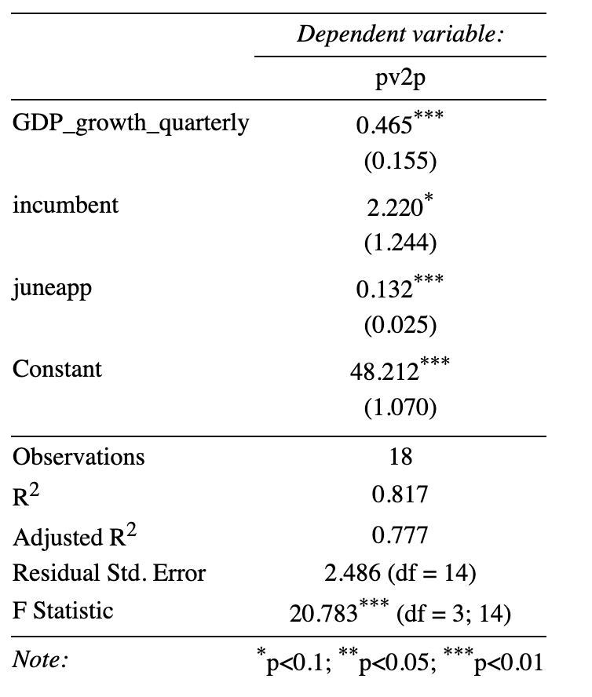

In this week's lab, we explore the impact of candidate or party incumbency on presidential election outcomes. More specifically, we ask "How should we treat the incumbency advantage in our 2024 electoral foreasts?". As always, my thanks to Matthew Dardet for his helpful starter code.


This week, we reviewed a canonically successful model used to predict the advantage of incumbency: the Time for Change Model by Alan Abramowitz. This relatively simple model -- an OLS regression with independent variables of Quarter 2 GDP, June Gallup poll approval, and whether or not one is an incumbent -- is modeled and tested here.


```
## 
## % Table created by stargazer v.5.2.3 by Marek Hlavac, Social Policy Institute. E-mail: marek.hlavac at gmail.com
## % Date and time: Sun, Sep 29, 2024 - 09:11:15
## \begin{table}[!htbp] \centering 
##   \caption{} 
##   \label{} 
## \begin{tabular}{@{\extracolsep{5pt}}lc} 
## \\[-1.8ex]\hline 
## \hline \\[-1.8ex] 
##  & \multicolumn{1}{c}{\textit{Dependent variable:}} \\ 
## \cline{2-2} 
## \\[-1.8ex] & pv2p \\ 
## \hline \\[-1.8ex] 
##  GDP\_growth\_quarterly & 0.465$^{***}$ \\ 
##   & (0.155) \\ 
##   & \\ 
##  incumbent & 2.220$^{*}$ \\ 
##   & (1.244) \\ 
##   & \\ 
##  juneapp & 0.132$^{***}$ \\ 
##   & (0.025) \\ 
##   & \\ 
##  Constant & 48.212$^{***}$ \\ 
##   & (1.070) \\ 
##   & \\ 
## \hline \\[-1.8ex] 
## Observations & 18 \\ 
## R$^{2}$ & 0.817 \\ 
## Adjusted R$^{2}$ & 0.777 \\ 
## Residual Std. Error & 2.486 (df = 14) \\ 
## F Statistic & 20.783$^{***}$ (df = 3; 14) \\ 
## \hline 
## \hline \\[-1.8ex] 
## \textit{Note:}  & \multicolumn{1}{r}{$^{*}$p$<$0.1; $^{**}$p$<$0.05; $^{***}$p$<$0.01} \\ 
## \end{tabular} 
## \end{table}
```



# Citations:
 
 (1) Hlavac, Marek (2022). stargazer: Well-Formatted Regression and Summary Statistics Tables.
 R package version 5.2.3. https://CRAN.R-project.org/package=stargazer 
